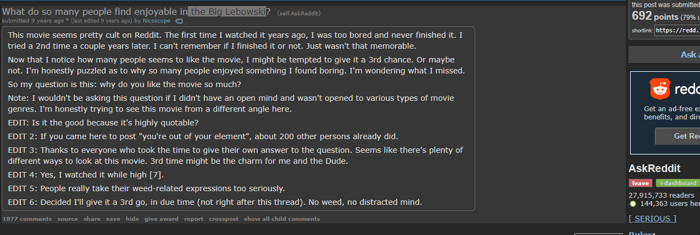

<h1 align="center">
  Easy IMDb extension
</h1>

- Quick highlight-lookup for movie titles 
- Currently only working for chrome
- Displays all important information about a title

<h1 align="center">
Getting started
</h1>

### [Add VIA chrome store](https://chrome.google.com/webstore/detail/easy-imdb/edkkkggfhmoogadkmjndmlfhlmdainam/)

<h1 align="center">
Manual install
</h1>

- Fork or clone repository 
- Go to `chrome://extensions/` inside your chrome browser and toggle `Developer mode`. 
- Click `Load unpacked` and browse to the directory containing the Extension. 

